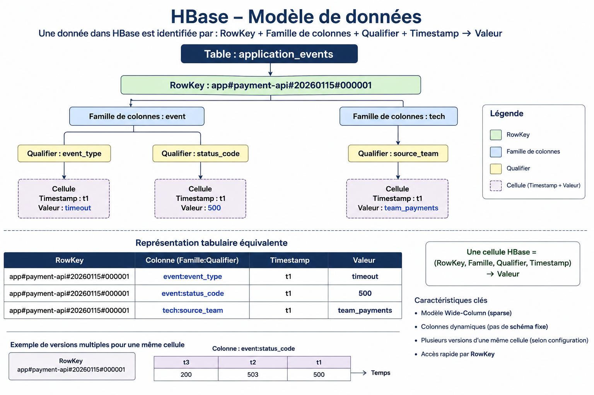

# TP 07 - HBase : accès par clé, versionnement et intégration DORA

## Objectifs

À la fin de ce TP, vous devez être capable de :

- expliquer pourquoi HBase existe dans l'écosystème Hadoop ;
- distinguer les usages de HDFS, Hive, Spark et HBase ;
- comprendre les notions de table, RowKey, famille de colonnes, qualifier, cellule et version ;
- créer des tables HBase adaptées à des accès par clé ;
- insérer, lire, scanner et filtrer des données avec `hbase shell` ;
- concevoir une RowKey pour éviter les points chauds ;
- utiliser le versionnement pour conserver l'historique d'un état ;
- proposer un modèle HBase utile au projet fil rouge DORA ;
- identifier les limites de HBase pour l'archivage et l'analyse globale.

## Pourquoi HBase ?

HBase est une base NoSQL distribuée orientée colonnes, construite au-dessus de HDFS.

HDFS est excellent pour stocker de gros fichiers, mais il n'est pas conçu pour faire des lectures et écritures aléatoires ligne par ligne. Hive permet d'interroger des fichiers avec SQL, mais il est plutôt adapté aux analyses batch. Spark permet de transformer de gros volumes, mais il n'est pas une base de données de consultation opérationnelle.

HBase répond à un autre besoin : retrouver rapidement une ligne ou un petit ensemble de lignes à partir d'une clé.

Dans une architecture DORA, HBase peut servir à :

- retrouver rapidement l'état d'un incident par identifiant ;
- consulter les événements récents d'une application ;
- maintenir un index technique vers des fichiers archivés dans HDFS ;
- exposer des indicateurs opérationnels pré-calculés ;
- conserver plusieurs versions d'un statut ou d'une preuve de contrôle.

HBase ne remplace pas le Data Lake. Les fichiers bruts et les preuves complètes restent dans HDFS. HBase sert plutôt de couche d'accès rapide et d'indexation.

## Positionnement dans le projet fil rouge

Dans le projet DORA :

- HDFS conserve les logs bruts, les archives et les preuves ;
- Spark transforme les logs et produit des indicateurs ;
- Hive expose les données traitées pour les analyses SQL ;
- HBase permet des recherches ciblées par clé, par application, par incident ou par date récente.

Un bon usage de HBase commence toujours par les questions d'accès :

- quelle clé connaît l'utilisateur au moment de la recherche ?
- faut-il lire une seule ligne, une plage de lignes ou toute une table ?
- quelle fraîcheur de donnée est attendue ?
- combien de versions d'un état faut-il garder ?
- quelles données doivent rester dans HDFS plutôt que dans HBase ?

## Prérequis

Vous pouvez réaliser ce TP dans l'environnement Docker local du TP 01 ou sur le
gateway Hadoop du cours.

### Option A - Docker local

Démarrez l'environnement Docker du TP 01, puis entrez dans le conteneur avec
l'utilisateur `hadoop`.

```bash
cd tp/01-big-data-hadoop
docker compose up -d
docker exec -it --user hadoop tp-hadoop bash
```

Dans le conteneur, initialisez la variable `USER` et vérifiez que HDFS et HBase
répondent.

```bash
export USER=$(whoami)
hdfs dfs -ls /
hbase version
hbase shell
```

Dans `hbase shell`, testez le statut du cluster.

```ruby
status
version
whoami
exit
```

Interfaces locales utiles :

| Service | URL |
|---|---|
| HBase Master UI | <http://localhost:16010> |
| HBase RegionServer | <http://localhost:16030> |
| NameNode UI | <http://localhost:9870> |
| YARN ResourceManager | <http://localhost:8088> |

L'environnement Docker contient un seul RegionServer HBase. Il permet de créer
les tables, de tester les RowKey, les scans, les filtres et le versionnement. Les
observations sur la distribution des régions ou les points chauds doivent être
interprétées comme une version locale simplifiée.

### Option B - Gateway Hadoop du cours

Connectez-vous au gateway Hadoop avec votre compte étudiant.

```bash
ssh -i ~/.ssh/m2-hadoop-student identifiant@<gateway_public_ip>
```

Chargez les environnements Hadoop et HBase.

```bash
source /etc/profile.d/hadoop.sh
source /etc/profile.d/hbase.sh
```

Vérifiez que HDFS et HBase répondent.

```bash
hdfs dfs -ls /
hbase version
hbase shell
```

Dans `hbase shell`, testez le statut du cluster.

```ruby
status
version
whoami
exit
```

Interfaces utiles :

| Service | URL |
|---|---|
| HBase Master UI | `http://<gateway_public_ip>:16010` |
| HBase RegionServer | `http://<gateway_public_ip>:16030` |
| NameNode UI | `http://<gateway_public_ip>:9870` |
| YARN ResourceManager | `http://<gateway_public_ip>:8088` |

## Exercice 1 - Situer HBase dans l'architecture

Répondez aux questions suivantes.

1. Quel besoin HBase couvre-t-il dans une plateforme Big Data ?
2. Dans le projet DORA, quels accès rapides pourraient justifier HBase ?
3. Quelles données doivent rester dans HDFS même si un index HBase existe ?

## Exercice 2 - Comprendre le modèle de données HBase

HBase stocke les données sous forme de cellules identifiées par :

```text
RowKey + famille de colonnes + qualifier + timestamp
```

Exemple logique :

```text
RowKey:       app#payment-api#20260115#000001
Famille:      event
Qualifier:    event_type
Valeur:       timeout
Timestamp:    version de la cellule
```

Définition des éléments :

- `RowKey` : identifiant unique de la ligne HBase. Elle joue un rôle proche
  d'une clé primaire, mais elle détermine aussi l'ordre de stockage et de
  parcours des lignes.
- `Famille de colonnes` : groupe de colonnes défini à la création de la table.
  Les familles structurent le stockage physique et doivent rester peu nombreuses.
- `Qualifier` : nom de colonne à l'intérieur d'une famille. Il peut être ajouté
  librement sans modifier le schéma de la table.
- `Timestamp` : version d'une cellule. Une même cellule peut conserver plusieurs
  valeurs dans le temps.
- `Cellule` : emplacement logique identifié par une `RowKey`, une famille de
  colonnes et un qualifier. Avec le timestamp, HBase peut conserver plusieurs
  versions de cette cellule.
- `Valeur` : contenu stocké dans la cellule pour une combinaison
  `RowKey + famille + qualifier + timestamp`.

Comparaison avec une table relationnelle :

| Élément | Base relationnelle | HBase |
|---|---|---|
| Structure principale | Table `application_logs` | Table `application_events` |
| Identifiant | Clé primaire `id = 1` | RowKey `app#payment-api#20260115#000001` |
| Colonnes principales | `event_type`, `status_code`, `source_team` | Famille `event` avec qualifiers `event_type`, `status_code` |
| Valeurs principales | `timeout`, `500`, `team_payments` | `timeout`, `500` |
| Groupe complémentaire | Non nécessaire dans cet exemple | Autre famille `tech` |
| Colonne complémentaire | `source_team` | Qualifier `source_team` |
| Valeur complémentaire | `team_payments` | `team_payments` |
| Version | Non versionné par défaut | Timestamp `2026-01-15T08:02:15Z` |

Dans une base relationnelle, les colonnes sont définies dans le schéma de la
table. Dans HBase, seules les familles de colonnes sont définies à l'avance :
les qualifiers peuvent varier d'une ligne à l'autre.



Vue simplifiée du stockage :

Les lignes sont ordonnées par RowKey.

| RowKey | Famille `event` | Famille `tech` |
|---|---|---|
| `app#auth-service#20260115#000001` | `event_type=login` | `source_team=team_security` |
| `app#payment-api#20260115#000001` | `event_type=timeout`<br>`status_code=500` | `source_team=team_payments` |
| `app#payment-api#20260115#000002` | `event_type=payment`<br>`status_code=200` | `source_team=team_payments` |

Dans chaque famille, HBase stocke des cellules identifiées par :

```text
RowKey + famille de colonnes + qualifier + timestamp -> valeur
```

Répondez aux questions suivantes.

1. Quelle différence faites-vous entre une famille de colonnes et un qualifier ?
2. Pourquoi faut-il choisir les familles de colonnes avec soin ?
3. Pourquoi la RowKey est-elle centrale dans HBase ?
4. Pourquoi une mauvaise RowKey peut-elle créer un point chaud (trop de lectures
   ou d'écritures concentrées sur la même région HBase) ?

## Exercice 3 - Démarrer `hbase shell`

Démarrez le shell.

```bash
hbase shell
```

Listez les tables existantes.

```ruby
list
```

Créez un namespace personnel. Remplacez `identifiant` par votre identifiant.
Dans Docker, utilisez généralement `hadoop`. Sur le gateway du cluster, utilisez
votre identifiant étudiant.

```ruby
create_namespace 'dora_identifiant'
list_namespace
```

Un namespace HBase sert à regrouper des tables sous un même préfixe.

Comparaison avec une base relationnelle :

| Élément | Base relationnelle | HBase |
|---|---|---|
| Regroupement logique | Base ou schéma `dora_identifiant` | Namespace `dora_identifiant` |
| Table | `application_events` | `application_events` |
| Nom complet | `dora_identifiant.application_events` | `dora_identifiant:application_events` |

Répondez aux questions suivantes.

1. Pourquoi devez-vous utiliser votre propre namespace ?
2. Quel problème apparaîtrait si tout le monde créait les mêmes tables dans le namespace `default` ?

## Exercice 4 - Créer une table d'événements applicatifs

Créez une table pour indexer des événements applicatifs utiles au projet DORA.

```ruby
create 'dora_identifiant:application_events',
  { NAME => 'event', VERSIONS => 1 },
  { NAME => 'tech', VERSIONS => 1 },
  { NAME => 'audit', VERSIONS => 3 }
```

Vérifiez la table.

```ruby
list
describe 'dora_identifiant:application_events'
```

Familles proposées :

- `event` : données fonctionnelles de l'événement ;
- `tech` : métadonnées techniques de collecte ;
- `audit` : informations utiles pour la preuve et le contrôle.

Répondez aux questions suivantes.

1. Pourquoi séparer les colonnes en familles ?
2. Pourquoi la famille `audit` garde-t-elle plusieurs versions ?
3. Pourquoi ne pas créer une famille de colonnes pour chaque champ ?

## Exercice 5 - Insérer des événements

La RowKey est créée par l'application qui écrit dans HBase. Dans ce TP, vous la
construisez vous-même dans les commandes `put`. Dans un projet réel, elle serait
construite par le pipeline d'ingestion, un job Spark, un service applicatif ou un
connecteur de streaming. HBase ne devine pas la RowKey : il reçoit une clé déjà
construite.

Insérez quelques événements. La RowKey suit le format :

```text
app_id#date#reverse_timestamp#request_id
```

Cette forme regroupe les événements par application et par date. Le timestamp inversé permet de lire plus facilement les événements récents en premier dans certains modèles.

Dans les commandes suivantes, remplacez `dora_identifiant` par votre namespace.
Remplacez aussi `/user/identifiant/...` par votre chemin HDFS réel, par exemple
`/user/hadoop/...` dans Docker.

```ruby
put 'dora_identifiant:application_events', 'payment-api#20260115#9999999991#req-001', 'event:level', 'INFO'
put 'dora_identifiant:application_events', 'payment-api#20260115#9999999991#req-001', 'event:status_code', '200'
put 'dora_identifiant:application_events', 'payment-api#20260115#9999999991#req-001', 'event:response_time_ms', '120'
put 'dora_identifiant:application_events', 'payment-api#20260115#9999999991#req-001', 'tech:source_team', 'team_payments'
put 'dora_identifiant:application_events', 'payment-api#20260115#9999999991#req-001', 'tech:hdfs_path', '/user/identifiant/datalake/raw/team_payments/application_logs/year=2026/month=01/day=15/payments_logs.csv'
put 'dora_identifiant:application_events', 'payment-api#20260115#9999999991#req-001', 'audit:ingestion_status', 'ACCEPTED'

put 'dora_identifiant:application_events', 'payment-api#20260115#9999999988#req-002', 'event:level', 'WARN'
put 'dora_identifiant:application_events', 'payment-api#20260115#9999999988#req-002', 'event:status_code', '200'
put 'dora_identifiant:application_events', 'payment-api#20260115#9999999988#req-002', 'event:response_time_ms', '920'
put 'dora_identifiant:application_events', 'payment-api#20260115#9999999988#req-002', 'tech:source_team', 'team_payments'
put 'dora_identifiant:application_events', 'payment-api#20260115#9999999988#req-002', 'audit:ingestion_status', 'ACCEPTED'

put 'dora_identifiant:application_events', 'auth-service#20260115#9999999982#req-101', 'event:level', 'ERROR'
put 'dora_identifiant:application_events', 'auth-service#20260115#9999999982#req-101', 'event:status_code', '401'
put 'dora_identifiant:application_events', 'auth-service#20260115#9999999982#req-101', 'event:response_time_ms', '95'
put 'dora_identifiant:application_events', 'auth-service#20260115#9999999982#req-101', 'tech:source_team', 'team_security'
put 'dora_identifiant:application_events', 'auth-service#20260115#9999999982#req-101', 'audit:ingestion_status', 'REVIEW_REQUIRED'
```

Répondez aux questions suivantes.

1. Quelles informations sont encodées dans la RowKey ?
2. Quels avantages et limites voyez-vous dans cette RowKey ?
3. Pourquoi stocker le chemin HDFS du fichier source dans HBase ?

## Exercice 6 - Lire par clé

Lisez une ligne complète.

```ruby
get 'dora_identifiant:application_events', 'payment-api#20260115#9999999991#req-001'
```

Lisez une seule famille.

```ruby
get 'dora_identifiant:application_events',
  'payment-api#20260115#9999999991#req-001',
  { COLUMN => 'event' }
```

Lisez une seule cellule.

```ruby
get 'dora_identifiant:application_events',
  'payment-api#20260115#9999999991#req-001',
  { COLUMN => 'event:level' }
```

Répondez aux questions suivantes.

1. Pourquoi `get` est-il efficace dans HBase ?
2. Quelle information faut-il connaître pour utiliser `get` ?
3. Pourquoi ce mode d'accès est-il différent d'une requête Hive ?

## Exercice 7 - Scanner une plage de lignes

Scannez les événements d'une application pour une date.

```ruby
scan 'dora_identifiant:application_events',
  {
    STARTROW => 'payment-api#20260115#',
    STOPROW => 'payment-api#20260116#'
  }
```

Limitez les colonnes lues.

```ruby
scan 'dora_identifiant:application_events',
  {
    STARTROW => 'payment-api#20260115#',
    STOPROW => 'payment-api#20260116#',
    COLUMNS => ['event:level', 'event:status_code', 'event:response_time_ms']
  }
```

Répondez aux questions suivantes.

1. Pourquoi le scan utilise-t-il `STARTROW` et `STOPROW` ?
2. Pourquoi cette requête fonctionne-t-elle bien avec la RowKey choisie ?
3. Que se passerait-il si la RowKey commençait par `request_id` ?
4. Pourquoi faut-il éviter les scans complets sur de très grandes tables HBase ?

## Exercice 8 - Filtrer les événements

Utilisez un filtre sur la valeur du niveau.

```ruby
scan 'dora_identifiant:application_events',
  {
    COLUMNS => ['event:level', 'event:status_code'],
    FILTER => "SingleColumnValueFilter('event','level',=,'binary:ERROR')"
  }
```

Utilisez un filtre sur le préfixe de RowKey.

```ruby
scan 'dora_identifiant:application_events',
  {
    FILTER => "PrefixFilter('auth-service#20260115#')"
  }
```

Répondez aux questions suivantes.

1. Quelle différence faites-vous entre filtrer par RowKey et filtrer par valeur ?
2. Pourquoi un filtre par valeur peut-il rester coûteux ?
3. Dans quel cas créeriez-vous une deuxième table HBase servant d'index ?

## Exercice 9 - Créer une table d'incidents

Les incidents sont de bons candidats pour HBase, car on veut souvent les retrouver rapidement par identifiant.

Créez une table dédiée.

```ruby
create 'dora_identifiant:incidents',
  { NAME => 'identity', VERSIONS => 1 },
  { NAME => 'state', VERSIONS => 5 },
  { NAME => 'links', VERSIONS => 1 },
  { NAME => 'audit', VERSIONS => 5 }
```

Insérez un incident.

Dans les commandes suivantes, remplacez `dora_identifiant` par votre namespace
et `/user/identifiant/...` par votre chemin HDFS réel.

```ruby
put 'dora_identifiant:incidents', 'incident#20260115#INC-0001', 'identity:app_id', 'payment-api'
put 'dora_identifiant:incidents', 'incident#20260115#INC-0001', 'identity:criticality', 'high'
put 'dora_identifiant:incidents', 'incident#20260115#INC-0001', 'state:status', 'OPEN'
put 'dora_identifiant:incidents', 'incident#20260115#INC-0001', 'state:owner_team', 'team_payments'
put 'dora_identifiant:incidents', 'incident#20260115#INC-0001', 'links:first_event_rowkey', 'payment-api#20260115#9999999988#req-002'
put 'dora_identifiant:incidents', 'incident#20260115#INC-0001', 'links:hdfs_evidence_path', '/user/identifiant/datalake/audit/spark/daily_team_metrics_parquet/event_date=2026-01-15'
put 'dora_identifiant:incidents', 'incident#20260115#INC-0001', 'audit:last_update_reason', 'incident detected from slow response'
```

Lisez l'incident.

```ruby
get 'dora_identifiant:incidents', 'incident#20260115#INC-0001'
```

Répondez aux questions suivantes.

1. Pourquoi stocker des liens vers HDFS plutôt que toutes les preuves dans HBase ?
2. Quelle différence faites-vous entre `identity`, `state`, `links` et `audit` ?
3. Quels autres champs ajouteriez-vous pour suivre un incident réglementaire ?

## Exercice 10 - Utiliser le versionnement

Mettez à jour le statut de l'incident plusieurs fois.

```ruby
put 'dora_identifiant:incidents', 'incident#20260115#INC-0001', 'state:status', 'INVESTIGATING'
put 'dora_identifiant:incidents', 'incident#20260115#INC-0001', 'audit:last_update_reason', 'analysis started'

put 'dora_identifiant:incidents', 'incident#20260115#INC-0001', 'state:status', 'RESOLVED'
put 'dora_identifiant:incidents', 'incident#20260115#INC-0001', 'audit:last_update_reason', 'service recovered'
```

Lisez la dernière version.

```ruby
get 'dora_identifiant:incidents',
  'incident#20260115#INC-0001',
  { COLUMN => 'state:status' }
```

Lisez plusieurs versions.

```ruby
get 'dora_identifiant:incidents',
  'incident#20260115#INC-0001',
  { COLUMN => 'state:status', VERSIONS => 5 }
```

Répondez aux questions suivantes.

1. Pourquoi le versionnement est-il utile pour suivre le cycle de vie d'un incident ?
2. Quelle différence faites-vous entre une version HBase et une ligne d'historique métier explicite ?
3. Pourquoi faut-il limiter le nombre de versions conservées ?

## Exercice 11 - Éviter les mauvaises RowKey

Comparez ces RowKey possibles pour des événements :

```text
20260115#payment-api#req-001
payment-api#20260115#req-001
req-001
ERROR#20260115#payment-api#req-001
salt03#payment-api#20260115#req-001
```

Répondez aux questions suivantes.

1. Quelle RowKey est adaptée pour lire les événements d'une application sur une date ?
2. Quelle RowKey est adaptée pour retrouver un événement par `request_id` ?
3. Quelle RowKey risque de créer un point chaud si toutes les écritures arrivent sur la même date ?
4. Quel compromis un préfixe de salage comme `salt03` introduit-il pour les scans ?
5. Quelle RowKey proposeriez-vous pour le projet DORA et pourquoi ?

## Exercice 12 - Charger un gros volume et observer les régions

HBase découpe les tables en régions. Une région contient une plage de RowKey.
Quand le volume augmente, HBase peut découper une région en plusieurs régions.
Il est aussi possible de créer une table avec des points de découpage dès le
départ.

Créez une table dédiée au chargement volumineux avec des régions pré-découpées.

```ruby
create 'dora_identifiant:bulk_application_events',
  { NAME => 'event', VERSIONS => 1 },
  { NAME => 'tech', VERSIONS => 1 },
  SPLITS => ['app03#', 'app06#', 'app09#']
```

Observez la structure de la table.

```ruby
describe 'dora_identifiant:bulk_application_events'
```

Préparez un fichier CSV à importer. Cette commande est à exécuter dans le shell
Linux, pas dans `hbase shell`.

La génération peut prendre un peu de temps selon les ressources disponibles dans
le conteneur ou sur le cluster.

```bash
mkdir -p /tmp/tp07-hbase
CSV_FILE=/tmp/tp07-hbase/bulk_application_events.csv
: > "$CSV_FILE"

for i in $(seq 1 50000); do
  app=$(printf "app%02d" $(( (i % 12) + 1 )))
  day=$(printf "%02d" $(( (i % 28) + 1 )))
  rowkey="${app}#202602${day}#$(printf "%08d" "$i")"
  status="OK"

  if [ $(( i % 10 )) -eq 0 ]; then
    status="ERROR"
  fi

  echo "${rowkey},${status},$((100 + (i % 900))),host-$((i % 20))" >> "$CSV_FILE"
done

head "$CSV_FILE"
wc -l "$CSV_FILE"
```

Déposez le fichier CSV dans HDFS.

```bash
hdfs dfs -mkdir -p /user/$USER/tp07/hbase-import
hdfs dfs -put -f "$CSV_FILE" /user/$USER/tp07/hbase-import/
hdfs dfs -ls /user/$USER/tp07/hbase-import/
```

Importez le CSV dans HBase avec `ImportTsv`.

La commande est la même dans Docker et depuis la gateway. Elle lance un job
MapReduce sur YARN : le chargement est donc visible dans le ResourceManager.

```bash
hbase org.apache.hadoop.hbase.mapreduce.ImportTsv \
  -Dimporttsv.separator=, \
  -Dimporttsv.columns=HBASE_ROW_KEY,event:status,event:response_time_ms,tech:host \
  dora_identifiant:bulk_application_events \
  /user/$USER/tp07/hbase-import/bulk_application_events.csv
```

Si l'erreur `ADD_OPENS: No such file or directory` apparaît, HBase ne charge pas
le classpath Hadoop du cluster dans le bon ordre. Il faut corriger la
configuration de l'infrastructure avant de relancer l'import.

Vérifiez le nombre de lignes chargées.

```ruby
count 'dora_identifiant:bulk_application_events', INTERVAL => 1000
```

Observez les régions de la table.

```ruby
list_regions 'dora_identifiant:bulk_application_events'
```

Utilisez l'interface HBase Master ou interrogez la table système `hbase:meta`.

```ruby
scan 'hbase:meta',
  {
    FILTER => "PrefixFilter('dora_identifiant:bulk_application_events')",
    COLUMNS => ['info:regioninfo']
  }
```

Depuis l'interface HBase Master, ouvrez la table
`dora_identifiant:bulk_application_events` et observez :

- le nombre de régions ;
- les clés de début et de fin de chaque région ;
- le RegionServer qui héberge chaque région.

Après l'import, actualisez la page de la table dans HBase Master pour observer
l'augmentation du nombre de lignes stockées dans les régions. Le job d'import
apparaît aussi dans le ResourceManager.

Dans Docker, un seul RegionServer est généralement disponible. Plusieurs régions
peuvent donc exister, même si elles sont hébergées par le même RegionServer.

Répondez aux questions suivantes.

1. Pourquoi la table contient-elle plusieurs régions dès sa création ?
2. Quel lien existe-t-il entre les points de découpage `SPLITS` et les plages de RowKey ?
3. Pourquoi un chargement massif avec des RowKey mal réparties peut-il créer un point chaud ?
4. Pourquoi plusieurs régions ne signifient-elles pas forcément plusieurs machines dans Docker ?
5. Pourquoi `ImportTsv` est-il plus adapté qu'une suite de commandes `put` pour un gros volume ?

## Exercice 13 - Comparer HBase, Hive et HDFS

Complétez le tableau suivant dans votre compte rendu.

| Besoin | Outil recommandé | Justification |
|---|---|---|
| Conserver les logs bruts pendant plusieurs années |  |  |
| Calculer des indicateurs quotidiens |  |  |
| Faire des requêtes SQL analytiques |  |  |
| Retrouver rapidement un incident par identifiant |  |  |
| Retrouver rapidement les incidents d'une application |  |  |
| Scanner tous les logs d'une année |  |  |
| Consulter le dernier statut d'un incident |  |  |
| Conserver les fichiers originaux immuables |  |  |

Répondez aux questions suivantes.

1. Pourquoi HBase n'est-il pas l'outil principal pour scanner tous les logs d'une année ?
2. Pourquoi Hive est plus naturel pour les agrégations SQL ?
3. Pourquoi HDFS reste la source de vérité pour les fichiers archivés ?


## Nettoyage

Ne supprimez les tables que si l'enseignant le demande.

```ruby
disable 'dora_identifiant:application_events'
drop 'dora_identifiant:application_events'

disable 'dora_identifiant:incidents'
drop 'dora_identifiant:incidents'

disable 'dora_identifiant:bulk_application_events'
drop 'dora_identifiant:bulk_application_events'
```

Si vous voulez supprimer le namespace, il doit être vide.

```ruby
drop_namespace 'dora_identifiant'
```

## À retenir

HBase est utile quand l'accès principal se fait par clé ou par plage de clés.

Les points importants de cette séance sont :

- HBase complète HDFS, Spark et Hive, mais ne les remplace pas ;
- la RowKey détermine fortement les performances ;
- les familles de colonnes doivent rester peu nombreuses et stables ;
- HBase trie les lignes par RowKey ;
- `get` est adapté à une recherche directe ;
- `scan` est adapté à une plage bien conçue ;
- les filtres ne compensent pas une mauvaise RowKey ;
- le versionnement peut aider à suivre l'évolution d'un état ;
- dans DORA, HBase est pertinent pour les incidents et les consultations rapides par clé ;
- les preuves complètes et les archives restent dans HDFS.
